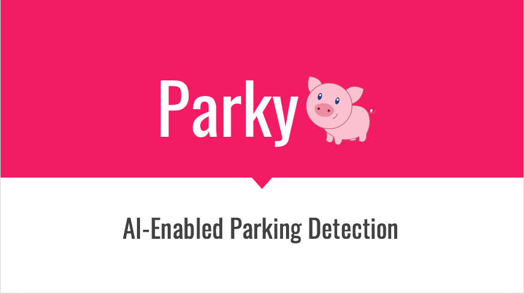
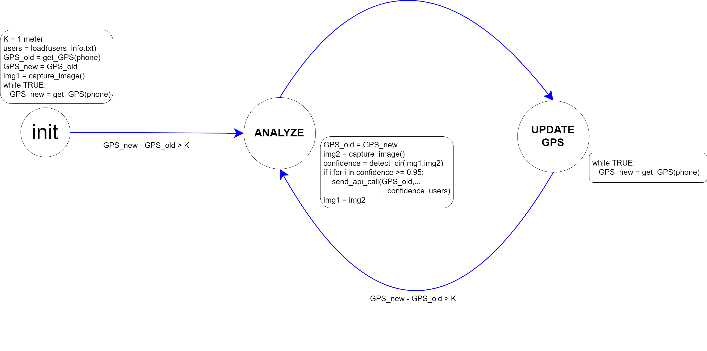

# IDD Final Project: Parky - AI Parking Assistant

#### Eduardo Castillo (EC833), Bar Kadosh (BK497), Ben Kadosh (BK499), & Jeremy Walker (JDW342)

##### The purpose of Parky is to bring real time parking and city dynamics information to citizens and drivers across large cities. Parky uses GPS and computer vision feature detection algorithms to detect the position of parking spaces around a city. Parky is envisioned as a low-cost embedded computing platform amenable for installation in any vehicle, from uBer and Lyft vehicles to food delivery bicycles.

  

[See Our Current Work Here](https://github.com/jwalker34/Interactive-Lab-Hub/blob/master/Parky/Parky_Presentation.pptx)

[Or Visit Our Website](http://parky.tech)

